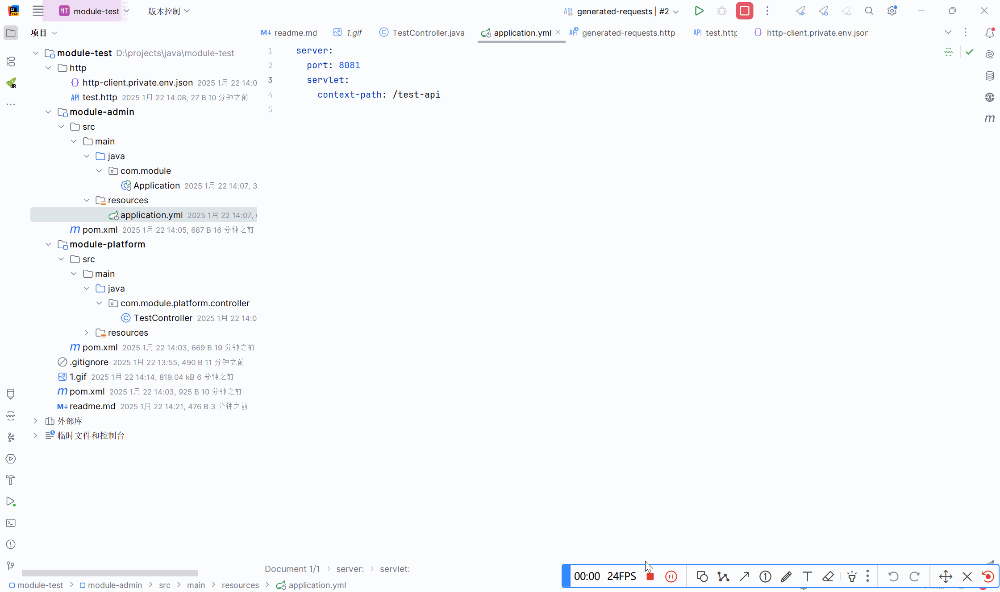

项目的端口我改为了8081，然后添加context-path=/test-api  
在Maven多模块的情况下，如果不是在spring boot启动模块中的controller，通过点击端点快捷生成请求时，
端口和context-path并不会被识别，如同上图所示，所以每次我需要手动去修改这些端口和添加context-path  
  
但是我看自动生成快捷请求时，基础url也就是**http://localhost:8080**
这块是被默认选中的，如同live template模板中的变量一样，所以我就在想着这部分是否可以进行手动配置，以便我以后使用端点生成快捷请求的时候 
不需要再去修改端口和context-path这部分  

因为使用端点生成快捷请求测试接口太频繁了，所以方便一点就可以省不少时间  

idea版本信息如下  

